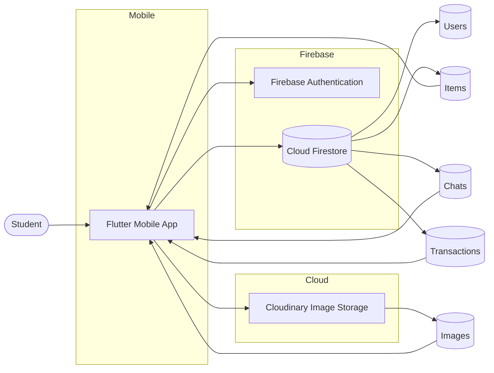
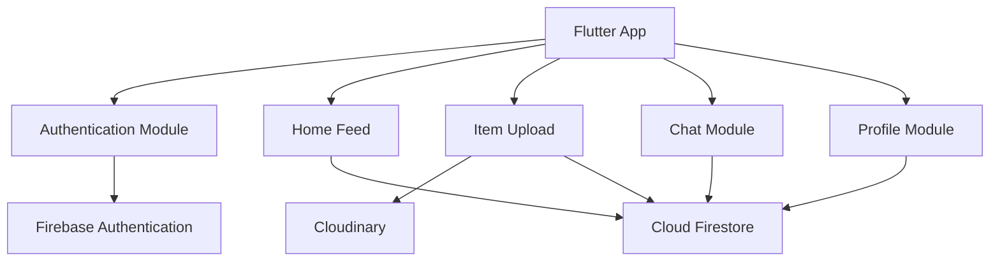
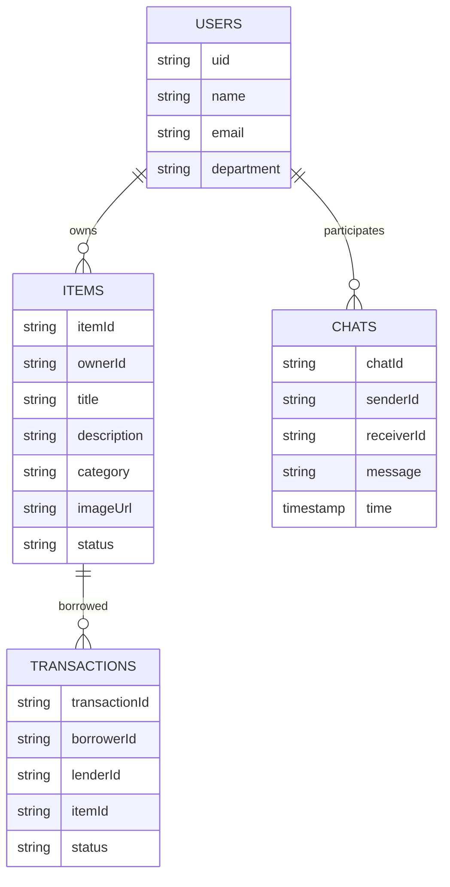
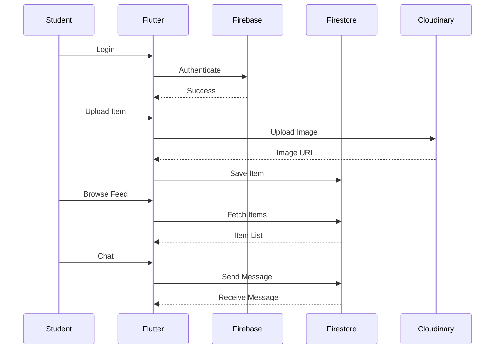

\# 📚 Campus Resource Sharing App

### Open Innovation – Campus Resource Sharing

A **campus-exclusive resource-sharing mobile application** that connects students for borrowing and lending academic resources such as books, calculators, lab equipment, gadgets, and other study materials.

- 📢 Lenders post items publicly like a social feed.
- 🔍 Borrowers browse available resources.
- 💬 Students negotiate privately through in-app chat.
- 📍 Meetups happen at convenient campus locations.
- 🤝 The application only facilitates discovery and communication—it does not manage returns.

---

# 🧑‍🤝‍🧑 Team Details

**Team Name:** Code Alpha

**Team Leader:**
- T. Venkatesh

**Team Members:**
- S.L. Kesavanada
- T. Chasanth Reddy
- K. Charith

---

# 🚀 Problem Statement

Students frequently require temporary access to academic resources such as:

- Books
- Scientific calculators
- Lab equipment
- Electronic gadgets
- Course materials

However, purchasing these items is expensive, and existing rental platforms are neither campus-focused nor convenient.

There is currently no trusted, secure, and campus-specific platform that allows students to easily lend and borrow resources from one another.

---

# ❗ Problem & Opportunity

## Challenges

- High cost of purchasing academic items
- Limited access to rental services
- Lack of trust on public marketplaces
- No campus-specific platform
- Difficult to discover available resources nearby
- Poor communication between lenders and borrowers

## Opportunity

A dedicated campus-only platform can create a trusted ecosystem where students help each other by lending and borrowing resources safely and affordably.

---

# 💡 Solution Overview

Campus Resource Sharing App provides a secure platform exclusively for students.

### Lenders can

- Upload items
- Add descriptions
- Upload images
- Mention availability
- Receive requests

### Borrowers can

- Browse available resources
- Search by category
- View item details
- Start private conversations
- Negotiate borrowing terms

---

# 🌟 Unique Value Proposition

- 🎓 Campus-only users
- 🔒 Secure authentication using college email
- 💬 Real-time private messaging
- 📍 Campus meetup suggestions
- 📱 Social-media style item feed
- 💰 Free or low-cost borrowing
- ⚡ Fast and easy discovery

---

# 🔧 Features

## Authentication

- College email login
- Secure authentication using Firebase

## Item Feed

- Public feed
- Categories
- Search
- Item details
- Availability status

## Chat System

- One-to-one messaging
- Real-time updates
- Negotiate borrowing terms

## Image Upload

- Upload multiple images
- Cloudinary integration

## Meetups

- Suggest safe campus locations
- Arrange pickup

---

# 🧰 Technologies Used

## Frontend

- Flutter
- Dart

## Backend

- Firebase Authentication
- Cloud Firestore

## Cloud Services

- Cloudinary
- Firebase Hosting (Optional)

## Development Tools

- Android Studio
- VS Code
- Git
- GitHub

> All technologies used are available under free-tier plans, making the project suitable for hackathons and student development.

---

# 🔄 Process Flow

## Borrowing Flow

1. Login
2. Browse Feed
3. Select Item
4. Chat with Lender
5. Negotiate
6. Confirm Meetup
7. Collect Item

---

## Lending Flow

1. Login
2. Upload Item
3. Receive Chat Request
4. Negotiate
5. Confirm Meetup
6. Hand Over Item

---

# 🏗️ System Architecture

The application follows a **Client–Cloud Architecture** where the Flutter application acts as the client while Firebase and Cloudinary provide backend services.

## High-Level Architecture



---

## Component Architecture



---

## Database Architecture



---

## Data Flow



---

## Architecture Workflow

### Authentication

```
Student
      ↓
Flutter App
      ↓
Firebase Authentication
      ↓
Verified User
```

---

### Item Upload

```
Flutter App
      ↓
Select Image
      ↓
Cloudinary
      ↓
Image URL
      ↓
Cloud Firestore
```

---

### Borrowing

```
Browse Feed
      ↓
View Item
      ↓
Private Chat
      ↓
Negotiate
      ↓
Meetup
```

---

# 📂 Project Structure

```
lib/

│── main.dart

│

├── models/

│ ├── item_model.dart

│ ├── user_model.dart

│ └── chat_model.dart

│

├── services/

│ ├── auth_service.dart

│ ├── firestore_service.dart

│ ├── cloudinary_service.dart

│ └── chat_service.dart

│

├── screens/

│ ├── login_screen.dart

│ ├── home_screen.dart

│ ├── upload_screen.dart

│ ├── item_details_screen.dart

│ ├── chat_screen.dart

│ └── profile_screen.dart

│

├── widgets/

│ ├── item_card.dart

│ ├── chat_tile.dart

│ ├── category_chip.dart

│ └── custom_button.dart

│

└── utils/

├── constants.dart

└── helpers.dart
```

---

# 📂 How to Access Flutter Source Files

The Flutter project follows the standard Flutter project structure.

- The application starts from **lib/main.dart**.
- Screens are organized inside **lib/screens**.
- Firebase operations are handled inside **lib/services**.
- Models are inside **lib/models**.
- Reusable widgets are inside **lib/widgets**.
- Constants and helper functions are stored in **lib/utils**.

This modular architecture makes the project scalable, maintainable, and easy to extend.

---

# ⚙️ Feasibility

The MVP is fully achievable within a hackathon timeline because:

- Flutter enables rapid UI development.
- Firebase offers serverless backend services.
- Firestore provides real-time synchronization.
- Cloudinary simplifies image management.
- All services provide generous free tiers.

---

# 🔮 Future Scope

- ⭐ User Ratings
- 🤖 AI-based Recommendations
- 🧠 AI Item Categorization
- 🚫 Profanity Detection in Chat
- 📈 Analytics Dashboard
- 🔔 Push Notifications
- 📅 Borrowing History
- 📍 Live Location Sharing
- 💳 Payment Integration
- 🌐 Multi-campus Expansion

---

# 📌 Conclusion

Campus Resource Sharing App creates a trusted ecosystem where students can lend and borrow academic resources efficiently.

The platform encourages:

- Collaboration
- Sustainability
- Cost savings
- Resource optimization
- Stronger campus communities

By combining Flutter, Firebase, and Cloudinary, the application delivers a scalable, secure, and user-friendly solution that can easily expand to multiple campuses in the future.
